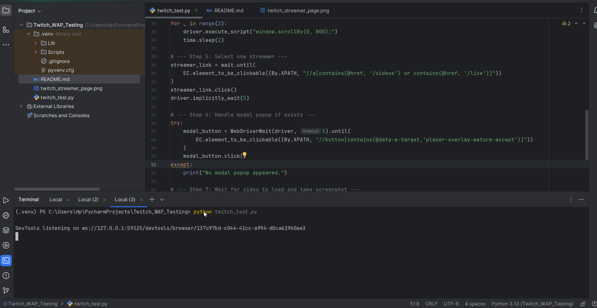

**Twitch Mobile Automation Test**
 
This project is a basic, scalable test automation framework built using Selenium and Python.
It is designed to test Twitch's mobile web view via Google Chrome mobile emulation.
This project focuses on good practices, clean structure, and popup handling, to serve as the starting point for a larger automation suite.

📦 **What the project is**

Automates the following test case:

* Go to Twitch.tv (in mobile emulation mode)

* Click on the Search icon

* Input "StarCraft II" into the search field

* (Handles any popups or modals that might appear before the search)

**Framework Features:**

* Mobile device emulation (e.g., Pixel 2)

* Selenium WebDriver setup with Chrome

* Easy to extend with new tests

* Small, clean codebase

**Required package**

* Selenium
* requests

**How to run the tests**
After installing the Packages, simply run the test in Terminal:

* python twitch_test,py

This will:

* Launch Chrome in mobile emulator mode

* Open Twitch.tv

* Search for "StarCraft II"

* Handle any popups automatically
* Scroll Down two times
* Play Live Streaming Video

**Test Running Demo**

This GIF shows the automation test running locally using Selenium, and Mobile Emulator:

